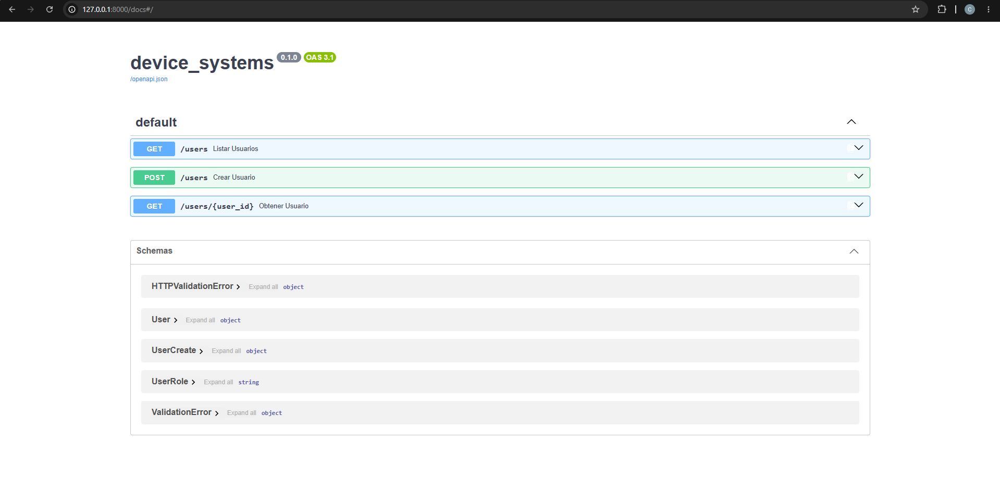

# device_systems

API REST desarrollada con FastAPI para la gestión del recurso usuarios. Este proyecto fue construido como reto integrador de la actividad Fundamentos de FastAPI, del programa ADSO en el SENA, Centro Tecnología y Manufactura Avanzada.

La aplicación permite listar usuarios, consultar uno por su identificador, filtrar por rol y por estado activo, y registrar nuevos usuarios, aplicando validaciones con Pydantic v2 y devolviendo respuestas estructuradas mediante response models y cabeceras HTTP personalizadas.

Repositorio: https://github.com/Cristian-Mesa/device_systems

## Estructura del proyecto

```
device_systems/
├── app/
│   ├── main.py
│   ├── schemas/
│   │   ├── __init__.py
│   │   └── user_schema.py
│   └── routes/
│       ├── __init__.py
│       └── user_routes.py
├── requirements.txt
└── README.md
```

## Instalación de dependencias

1. Clonar el repositorio

```
git clone https://github.com/Cristian-Mesa/device_systems.git
cd device_systems
```

2. Crear y activar un entorno virtual

```
python -m venv venv
venv\Scripts\activate.bat
```

3. Instalar las dependencias

```
pip install -r requirements.txt
```

## Ejecución del servidor

Ubicarse dentro de la carpeta app y correr uvicorn con recarga automática.

```
cd app
uvicorn main:app --reload
```

El servidor queda disponible en `http://127.0.0.1:8000`

Documentación interactiva de Swagger UI en `http://127.0.0.1:8000/docs`

## Modelo de usuario

Campos: id, name, email, role, is_active

Validaciones:
- name: mínimo 3 caracteres
- email: formato válido, mediante EmailStr
- role: solo admin, support o user
- is_active: booleano

Para separar lo que el cliente puede enviar de lo que el servidor genera, se definieron tres modelos: UserBase con los campos comunes, UserCreate que hereda de UserBase y se usa como cuerpo del POST sin id, y User que hereda de UserBase y agrega el id, usado para representar un usuario ya existente.

## Tabla de endpoints

| Método | Ruta | Descripción |
|---|---|---|
| GET | /users | Lista todos los usuarios, admite los query parameters role e is_active para filtrar |
| GET | /users/{user_id} | Consulta un usuario según su id |
| POST | /users | Registra un usuario nuevo, valida los datos y evita correos duplicados |

Todas las respuestas incluyen las cabeceras personalizadas X-App-Name con valor device_systems y X-API-Version con valor 1.0

## Ejemplos de peticiones

### GET /users

```
GET http://127.0.0.1:8000/users
```

Respuesta 200 OK

```json
[
  {
    "email": "ana@example.com",
    "name": "Ana Torres",
    "role": "admin",
    "is_active": true,
    "id": 1
  }
]
```

### GET /users con filtro por rol

```
GET http://127.0.0.1:8000/users?role=admin
```

### GET /users con filtro por estado activo

```
GET http://127.0.0.1:8000/users?is_active=true
```

### GET /users/{user_id}

```
GET http://127.0.0.1:8000/users/1
```

Si el id no existe, la API responde 404

```json
{
  "detail": "Usuario no encontrado"
}
```

### POST /users

```
POST http://127.0.0.1:8000/users
Content-Type: application/json

{
  "email": "laura@example.com",
  "name": "Laura Gómez",
  "role": "user",
  "is_active": true
}
```

Respuesta 200 OK, con el id generado por el servidor

```json
{
  "email": "laura@example.com",
  "name": "Laura Gómez",
  "role": "user",
  "is_active": true,
  "id": 5
}
```

Si el correo ya está registrado, la API responde 409

```json
{
  "detail": "Correo electrónico ya registrado"
}
```

Si los datos no cumplen las validaciones, por ejemplo un name de menos de 3 caracteres, la API responde 422 con el detalle del campo que falló.

## Evidencias de pruebas

Pruebas realizadas con Swagger UI y Thunder Client. Las capturas están en la carpeta evidencias.

### Swagger UI



### GET /users

Listado completo, sin filtros.


Consulta por id, con un id existente.


Filtro por rol usando query parameter.


### GET /users/{user_id}

Consulta con un id que no existe, respondiendo 404.


### POST /users

Creación de un usuario válido, respondiendo 200 con el id generado.


### Evidencia de validaciones y errores

Intento de registrar un correo ya existente, respondiendo 409.


Intento de registrar datos que no cumplen las validaciones de Pydantic, respondiendo 422.


Cabeceras personalizadas X-App-Name y X-API-Version presentes en la respuesta.


## Reflexión

Construir esta API con FastAPI permitió entender de forma práctica varios conceptos centrales del desarrollo de APIs REST. La separación entre modelos, rutas y el punto de entrada de la aplicación deja un proyecto organizado y fácil de extender. Pydantic v2 resultó especialmente útil porque las validaciones de los datos de entrada quedan declaradas directamente en el modelo, sin necesidad de escribir esa lógica a mano, y los errores que devuelve son claros tanto para quien consume la API como para quien la desarrolla. Trabajar con path parameters, query parameters, response models y cabeceras personalizadas dio una visión más completa de cómo se estructura una respuesta HTTP y por qué cada código de estado comunica algo distinto sobre lo que ocurrió con la petición.