# device_systems

API REST desarrollada con FastAPI para la gestión del recurso usuarios. Este proyecto nació como reto integrador de Fundamentos de FastAPI, evolucionó con un CRUD completo y manejo de errores en FastAPI Intermedio, y en esta tercera actividad incorpora persistencia real de datos mediante SQLAlchemy y una base de datos SQLite, dentro del programa ADSO en el SENA, Centro Tecnología y Manufactura Avanzada.

La aplicación ya no guarda los usuarios en una lista en memoria. Ahora cada usuario se crea, consulta, actualiza y elimina directamente sobre una base de datos, usando un modelo SQLAlchemy para la tabla y schemas Pydantic para validar lo que entra y sale de la API.

Repositorio: https://github.com/Cristian-Mesa/device_systems

## Tecnologías utilizadas

- Python
- FastAPI
- Uvicorn
- SQLAlchemy
- SQLite
- Pydantic v2
- Git y GitHub

## Estructura del proyecto

```
device_systems/
├── app/
│   ├── main.py
│   ├── database/
│   │   └── connection.py
│   ├── models/
│   │   └── user_model.py
│   ├── schemas/
│   │   └── user_schema.py
│   ├── routes/
│   │   └── user_routes.py
│   ├── services/
│   │   └── user_service.py
│   ├── dependencies/
│   │   └── database_dependency.py
│   └── data/
│       └── users_db.py
├── evidencias/
├── device_systems.db
├── requirements.txt
└── README.md
```

El proyecto sigue organizado por capas, y ahora suma dos nuevas:

- database: configura el motor de conexión, la sesión y la clase base de la que heredan los modelos
- models: define la tabla de la base de datos mediante clases de SQLAlchemy
- schemas: modelos Pydantic de entrada y salida de la API, y sus validaciones
- routes: define los endpoints, recibe las peticiones y delega el trabajo real
- services: contiene la lógica de negocio, ahora trabajando contra la base de datos a través de una sesión
- dependencies: entrega la sesión de base de datos a cada endpoint que la necesita

Esta separación deja claro algo importante: el modelo SQLAlchemy describe cómo se guardan los datos en la base de datos, mientras que los schemas Pydantic describen cómo se ven esos datos cuando entran o salen de la API. Son dos representaciones distintas de lo mismo, y mantenerlas separadas evita mezclar la lógica de persistencia con la validación de la API.

## Instalación de dependencias

1. Clonar el repositorio

```
git clone https://github.com/Cristian-Mesa/device_systems.git
cd device_systems
```

2. Crear y activar un entorno virtual

```
python -m venv venv
venv\Scripts\activate.bat
```

3. Instalar las dependencias

```
pip install -r requirements.txt
```

## Ejecución del servidor

Ubicarse dentro de la carpeta app y correr uvicorn con recarga automática.

```
cd app
uvicorn main:app --reload
```

El servidor queda disponible en `http://127.0.0.1:8000`

Documentación interactiva en `http://127.0.0.1:8000/docs`

Documentación alternativa en `http://127.0.0.1:8000/redoc`

Al levantar el servidor por primera vez, FastAPI crea automáticamente el archivo `device_systems.db` en la raíz del proyecto si todavía no existe, junto con la tabla users, usando la instrucción Base.metadata.create_all definida en main.py.

## Configuración de la base de datos

La conexión vive en app/database/connection.py. Se usa SQLite como base de datos, definida con la ruta sqlite:///./device_systems.db. Ese archivo contiene el engine de conexión, la sesión SessionLocal que se abre y se cierra en cada petición, y la clase Base de la que hereda el modelo de usuario.

La sesión se entrega a cada endpoint mediante una dependencia definida en app/dependencies/database_dependency.py, la función get_db, que abre una sesión, la deja disponible durante la petición y la cierra al terminar, sin importar si la operación fue exitosa o falló.

## Modelo de usuario

El modelo SQLAlchemy, en app/models/user_model.py, representa la tabla users con los siguientes campos y restricciones:

| Campo | Tipo | Restricción |
|---|---|---|
| id | Integer | llave primaria |
| name | String | obligatorio |
| email | String | único y obligatorio |
| role | String | obligatorio |
| is_active | Boolean | por defecto true |
| created_at | DateTime | se genera automáticamente al crear el registro |

Estas restricciones se aplican a nivel de base de datos, además de las validaciones que ya hace Pydantic antes de que el dato llegue hasta ahí.

## Schemas Pydantic

En app/schemas/user_schema.py se definieron cuatro schemas, cada uno pensado para un momento distinto:

- UserCreate: se usa como cuerpo del POST, con todos los campos obligatorios menos el id y la fecha de creación, que los genera la base de datos
- UserUpdate: se usa como cuerpo del PUT, exige todos los campos igual que UserCreate porque una actualización completa reemplaza todo el usuario
- Userpatch: se usa como cuerpo del PATCH, con todos los campos opcionales para permitir enviar solo lo que se quiere cambiar
- UserResponse: se usa para dar forma a lo que la API devuelve, incluye id y created_at, y tiene activado from_attributes para poder construirse directamente a partir del modelo SQLAlchemy

Validaciones mínimas:

- name: obligatorio, mínimo 3 caracteres
- email: formato válido mediante EmailStr
- role: solo puede ser admin, support o user, controlado con un Enum
- is_active: booleano, con valor por defecto true

## Tabla de endpoints

| Método | Ruta | Descripción | Código exitoso |
|---|---|---|---|
| GET | /users | Lista usuarios, admite filtros por role e is_active, y ordenamiento por name o created_at | 200 |
| GET | /users/{usuario_id} | Consulta un usuario por su id | 200 |
| POST | /users | Crea un usuario nuevo en la base de datos | 201 |
| PUT | /users/{usuario_id} | Reemplaza todos los campos de un usuario existente | 200 |
| PATCH | /users/{usuario_id} | Actualiza solo los campos enviados | 200 |
| DELETE | /users/{usuario_id} | Elimina un usuario existente de la base de datos | 204 |

## Ejemplos de peticiones

### GET /users

```
GET http://127.0.0.1:8000/users
```

Respuesta 200 OK

```json
[
  {
    "name": "cristian",
    "email": "user@example.com",
    "role": "admin",
    "is_active": true,
    "id": 2,
    "created_at": "2026-09-11T00:25:45.415641"
  },
  {
    "name": "messi",
    "email": "lapulga@example.com",
    "role": "admin",
    "is_active": true,
    "id": 1,
    "created_at": "2026-09-10T23:44:12.313301"
  }
]
```

Filtros disponibles: `GET /users?role=admin` y `GET /users?is_active=true`

### GET /users/{usuario_id}

```
GET http://127.0.0.1:8000/users/3
```

Si el id no existe, la API responde 404

```json
{
  "detail": "Usuario no encontrado"
}
```

### POST /users

```
POST http://127.0.0.1:8000/users
Content-Type: application/json

{
  "name": "cristian",
  "email": "user@example.com",
  "role": "admin",
  "is_active": true
}
```

Respuesta 201 Created, con el id y la fecha de creación generados por la base de datos

```json
{
  "name": "cristian",
  "email": "user@example.com",
  "role": "admin",
  "is_active": true,
  "id": 2,
  "created_at": "2026-09-11T00:25:45.415641"
}
```

Si el correo ya está registrado, la API responde 400.

```json
{
  "detail": "El email ya está registrado"
}
```

### PUT /users/{usuario_id}

Reemplaza todos los campos del usuario, exige enviarlos todos.

```
PUT http://127.0.0.1:8000/users/2
Content-Type: application/json

{
  "name": "labuenaprofe",
  "email": "user@example.com",
  "role": "admin",
  "is_active": true
}
```

Respuesta 200 OK con el usuario actualizado. Si falta algún campo obligatorio, responde 422. Si el correo ya pertenece a otro usuario, responde 400.

### PATCH /users/{usuario_id}

Actualiza solo los campos enviados.

```
PATCH http://127.0.0.1:8000/users/2
Content-Type: application/json

{
  "email": "elmejorestudiante@example.com"
}
```

Respuesta 200 OK con el usuario actualizado

```json
{
  "name": "labuenaprofe",
  "email": "elmejorestudiante@example.com",
  "role": "admin",
  "is_active": true,
  "id": 2,
  "created_at": "2026-09-11T00:25:45.415641"
}
```

Si el nuevo correo ya pertenece a otro usuario, responde 400.

### DELETE /users/{usuario_id}

```
DELETE http://127.0.0.1:8000/users/1
```

Respuesta 204 No Content, sin cuerpo en la respuesta. Si se intenta eliminar de nuevo el mismo id, responde 404.

```json
{
  "detail": "Usuario no encontrado"
}
```

## Códigos de estado usados

| Código | Cuándo se usa |
|---|---|
| 200 | Listar, consultar, actualizar completo y actualizar parcial exitosos |
| 201 | Creación exitosa de un usuario |
| 204 | Eliminación exitosa de un usuario |
| 400 | Correo duplicado al crear o actualizar |
| 404 | El usuario consultado, actualizado o eliminado no existe |
| 422 | Los datos enviados no cumplen las validaciones de Pydantic |

## Manejo de errores

Todos los errores se manejan lanzando HTTPException con el código y el detalle correspondiente, cubriendo:

- Usuario no encontrado, en cualquier operación por id
- Correo electrónico duplicado, al crear o al actualizar, incluso si el correo pertenece a otro usuario distinto al que se está modificando
- Datos inválidos, rechazados automáticamente por las validaciones de Pydantic antes de llegar a la base de datos
- Rol no permitido, controlado por el Enum del schema

## Diferencia entre modelo SQLAlchemy y schema Pydantic

El modelo, en app/models/user_model.py, describe la tabla real de la base de datos: sus columnas, sus tipos, y restricciones como unique o nullable. Es lo que SQLAlchemy usa para traducir código Python en sentencias SQL.

El schema, en app/schemas/user_schema.py, describe la forma de los datos que la API recibe o entrega, y no tiene relación directa con cómo se guardan. Por ejemplo, el schema puede exigir que un email tenga un formato válido antes de intentar guardarlo, algo que la base de datos por sí sola no verifica. Tener ambos separados permite cambiar la forma en que la API valida los datos sin tocar la tabla, o cambiar la estructura de la tabla sin romper la validación de entrada.

## Capturas del proyecto

Estructura del proyecto con las nuevas carpetas database y models, y el archivo device_systems.db ya generado en la raíz.

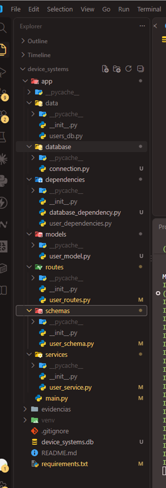

Documentación automática mostrando los 6 endpoints del recurso users.

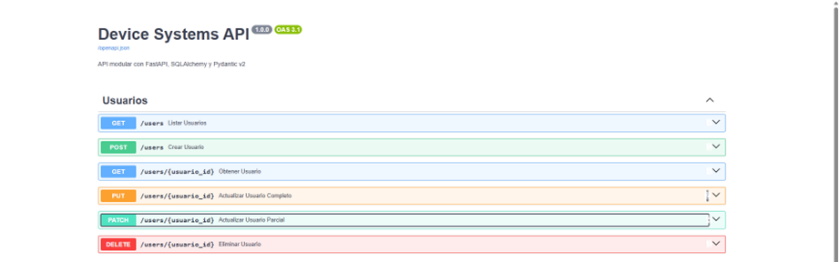

## Evidencias de pruebas

### POST /users

Creación de un usuario válido, respondiendo 201 con el id y la fecha de creación asignados por la base de datos.

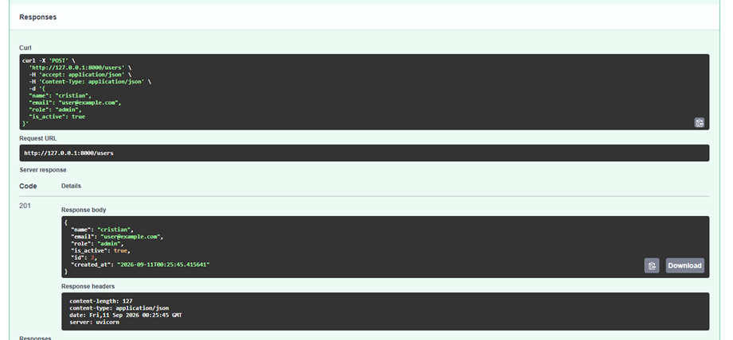

Intento de creación con un correo ya registrado, respondiendo 400.

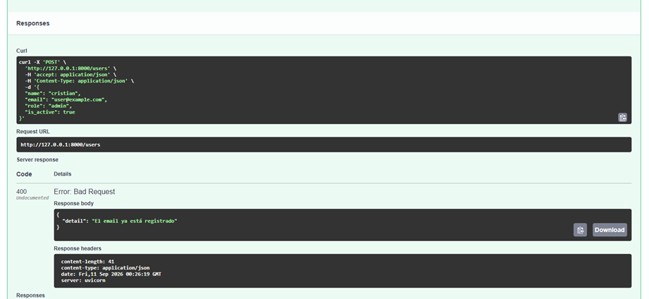

### GET /users

Listado completo de usuarios guardados en la base de datos.

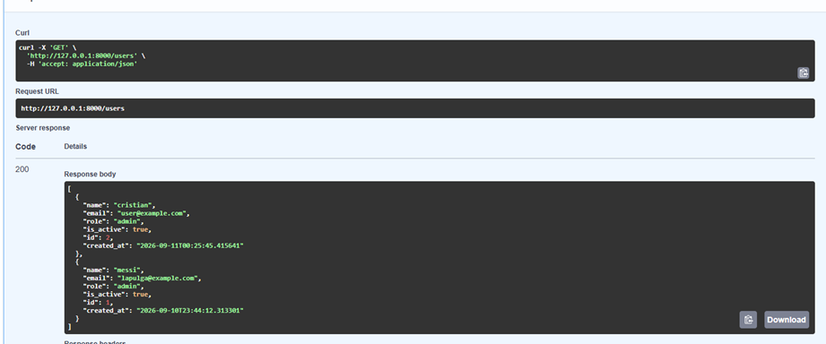

### GET /users/{usuario_id}

Consulta de un usuario existente por su id.

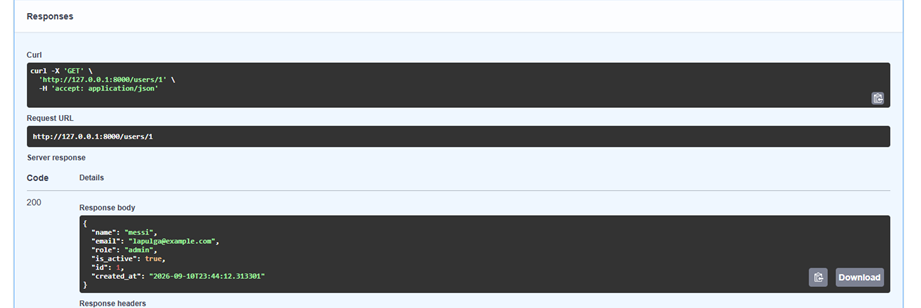

Consulta de un id que no existe, respondiendo 404.

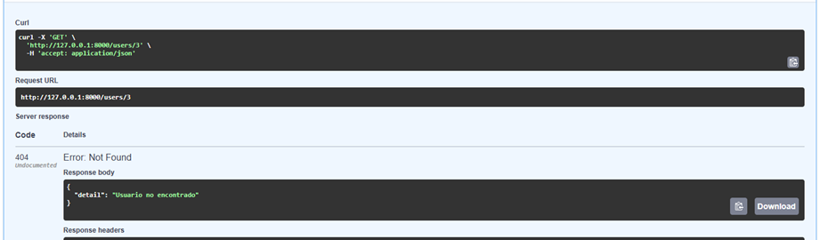

Filtro por rol usando query parameter.

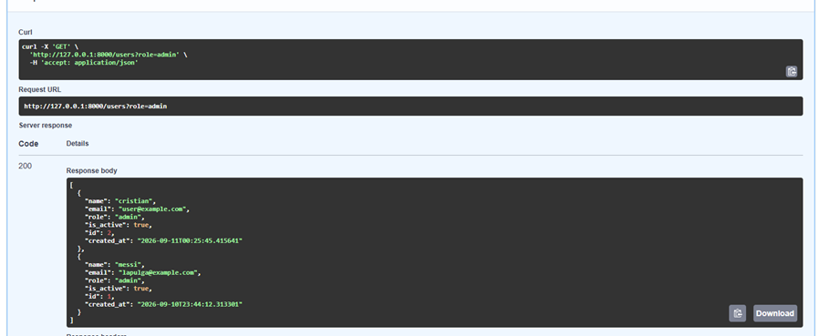

Filtro por estado activo usando query parameter.

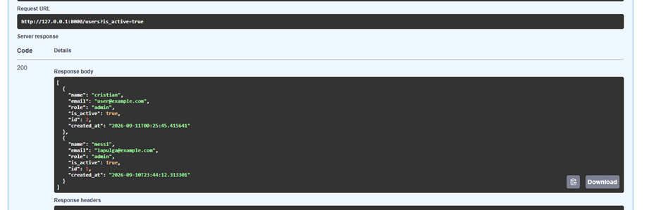

### PUT /users/{usuario_id}

Actualización completa de un usuario existente.

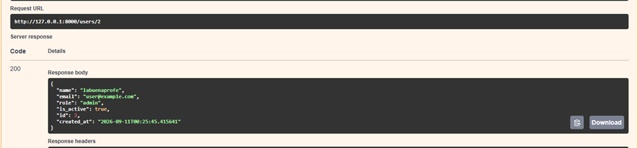

### PATCH /users/{usuario_id}

Actualización parcial, cambiando solo el correo del usuario.

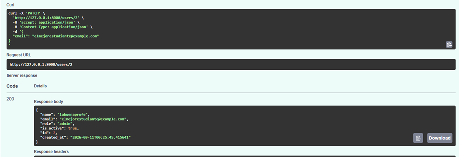

### DELETE /users/{usuario_id}

Eliminación exitosa de un usuario, respondiendo 204 sin contenido.

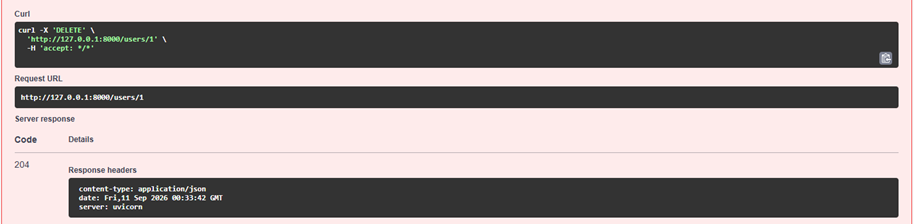

Intento de eliminar el mismo usuario una segunda vez, respondiendo 404.

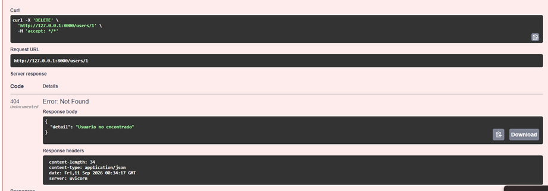

## Reflexión final

Pasar de una lista en memoria a una base de datos real cambió la forma de pensar el proyecto. Antes, reiniciar el servidor borraba todos los usuarios porque la lista vivía solo mientras el proceso estuviera corriendo, algo que no tiene sentido en una aplicación real. Ahora los datos sobreviven a reinicios del servidor porque quedan guardados en device_systems.db, y eso obligó a separar con más cuidado qué responsabilidad tiene cada capa: el modelo describe la tabla, el schema describe lo que viaja por la API, y el servicio es el único lugar que sabe cómo usar la sesión de base de datos para leer y escribir. Configurar SQLAlchemy dejó claro que el ORM no reemplaza SQL, lo traduce, y que entender ese puente ayuda a razonar mejor los errores cuando algo falla, por ejemplo un intento de guardar un correo duplicado que la base de datos rechaza por la restricción unique antes de que el código llegue a manejarlo manualmente. En general, esta actividad mostró por qué la persistencia real es uno de los pilares de cualquier API que se vaya a usar en producción, y por qué separar el modelo de datos de los schemas de validación es una decisión de diseño y no un simple detalle de organización de carpetas.
