# device_systems

API REST desarrollada con FastAPI para la gestión del recurso usuarios. Este proyecto nació como reto integrador de Fundamentos de FastAPI y evolucionó en una segunda actividad, FastAPI Intermedio, ambas del programa ADSO en el SENA, Centro Tecnología y Manufactura Avanzada.

La aplicación implementa un CRUD completo sobre usuarios: crear, listar, consultar por id, filtrar por rol y estado, actualizar completa o parcialmente, y eliminar. Incluye validaciones con Pydantic v2, manejo de errores con códigos HTTP correctos, reutilización de lógica mediante Dependency Injection, y documentación automática ampliada con Swagger UI y ReDoc.

Repositorio: https://github.com/Cristian-Mesa/device_systems

## Tecnologías utilizadas

- Python
- FastAPI
- Uvicorn
- Pydantic v2
- Git y GitHub
- Thunder Client, como cliente HTTP para las pruebas

## Estructura del proyecto

```
device_systems/
├── app/
│   ├── main.py
│   ├── schemas/
│   │   └── user_schema.py
│   ├── routes/
│   │   └── user_routes.py
│   ├── services/
│   │   └── user_service.py
│   ├── dependencies/
│   │   └── user_dependencies.py
│   └── data/
│       └── users_db.py
├── requirements.txt
└── README.md
```

El proyecto está organizado por capas, separando responsabilidades:

- schemas: modelos Pydantic de entrada y salida, y sus validaciones
- routes: define los endpoints, recibe las peticiones y delega el trabajo real
- services: contiene la lógica de negocio, sin nada de FastAPI involucrado
- dependencies: funciones reutilizables inyectadas con Depends en varias rutas
- data: simula la base de datos en memoria, una lista de usuarios que vive mientras el servidor está corriendo

Esta separación permite que, si en el futuro se cambia de dónde vienen los datos, por ejemplo pasando a una base de datos real, solo haya que tocar services y data, sin modificar las rutas.

## Instalación de dependencias

1. Clonar el repositorio

```
git clone https://github.com/Cristian-Mesa/device_systems.git
cd device_systems
```

2. Crear y activar un entorno virtual

```
python -m venv venv
venv\Scripts\activate.bat
```

3. Instalar las dependencias

```
pip install -r requirements.txt
```

## Ejecución del servidor

Ubicarse dentro de la carpeta app y correr uvicorn con recarga automática.

```
cd app
uvicorn main:app --reload
```

El servidor queda disponible en `http://127.0.0.1:8000`

Documentación interactiva de Swagger UI en `http://127.0.0.1:8000/docs`

Documentación alternativa de ReDoc en `http://127.0.0.1:8000/redoc`

## Modelo de usuario

Campos: id, name, email, role, is_active

Validaciones:
- name: mínimo 3 caracteres
- email: formato válido, mediante EmailStr
- role: solo admin, support o user
- is_active: booleano

Para separar lo que el cliente puede enviar de lo que el servidor genera o exige, se definieron cuatro modelos: UserBase con los campos comunes, UserCreate que hereda de UserBase y se usa como cuerpo del POST y del PUT sin id, User que hereda de UserBase y agrega el id, usado para representar un usuario ya existente, y UserUpdate con todos los campos opcionales, usado como cuerpo del PATCH para permitir actualizaciones parciales.

## Autenticación simulada

Las operaciones que modifican datos, POST, PUT, PATCH y DELETE, requieren una cabecera personalizada:

```
X-API-Key: device_systems_key
```

Si no se envía o el valor no coincide, la API responde 401. Las operaciones de solo lectura, GET, no requieren esta cabecera. Esta es una simulación simple de autenticación, no un mecanismo de seguridad real, implementada como ejercicio de Dependency Injection.

## Tabla de endpoints

| Método | Ruta | Descripción | Código exitoso | Requiere X-API-Key |
|---|---|---|---|---|
| GET | /users | Lista usuarios, admite filtros por role e is_active | 200 | No |
| GET | /users/{user_id} | Consulta un usuario por su id | 200 | No |
| POST | /users | Crea un usuario nuevo | 201 | Sí |
| PUT | /users/{user_id} | Reemplaza todos los campos de un usuario existente | 200 | Sí |
| PATCH | /users/{user_id} | Actualiza solo los campos enviados | 200 | Sí |
| DELETE | /users/{user_id} | Elimina un usuario existente | 200 | Sí |

Todas las respuestas incluyen las cabeceras personalizadas X-App-Name con valor device_systems y X-API-Version con valor 1.0

## Ejemplos de peticiones

### GET /users

```
GET http://127.0.0.1:8000/users
```

Respuesta 200 OK

```json
[
  {
    "email": "ana@example.com",
    "name": "Ana Torres",
    "role": "admin",
    "is_active": true,
    "id": 1
  }
]
```

Filtros disponibles: `GET /users?role=admin` y `GET /users?is_active=true`

### GET /users/{user_id}

```
GET http://127.0.0.1:8000/users/1
```

Si el id no existe, la API responde 404

```json
{
  "detail": "Usuario no encontrado"
}
```

### POST /users

```
POST http://127.0.0.1:8000/users
Content-Type: application/json
X-API-Key: device_systems_key

{
  "email": "laura@example.com",
  "name": "Laura Gómez",
  "role": "user",
  "is_active": true
}
```

Respuesta 201 Created, con el id generado por el servidor

```json
{
  "email": "laura@example.com",
  "name": "Laura Gómez",
  "role": "user",
  "is_active": true,
  "id": 5
}
```

Si el correo ya está registrado, la API responde 400.

### PUT /users/{user_id}

Reemplaza todos los campos del usuario. Requiere enviarlos todos.

```
PUT http://127.0.0.1:8000/users/2
Content-Type: application/json
X-API-Key: device_systems_key

{
  "email": "user@example.com",
  "name": "Ana Torres",
  "role": "admin",
  "is_active": true
}
```

Respuesta 200 OK con el usuario actualizado. Si falta algún campo obligatorio, responde 422. Si el correo ya pertenece a otro usuario, responde 400.

### PATCH /users/{user_id}

Actualiza solo los campos enviados.

```
PATCH http://127.0.0.1:8000/users/1
Content-Type: application/json
X-API-Key: device_systems_key

{
  "email": "nuevo_correo@example.com"
}
```

Respuesta 200 OK con el usuario actualizado. Si no se envía ningún campo, responde 400. Si el nuevo correo ya pertenece a otro usuario, responde 400.

### DELETE /users/{user_id}

```
DELETE http://127.0.0.1:8000/users/3
X-API-Key: device_systems_key
```

Respuesta 200 OK

```json
{
  "detail": "Usuario eliminado correctamente"
}
```

Si el usuario no existe, responde 404.

## Códigos de estado usados

| Código | Cuándo se usa |
|---|---|
| 200 | Listar, consultar, actualizar completo, actualizar parcial y eliminar exitosos |
| 201 | Creación exitosa de un usuario |
| 400 | Correo duplicado, o PATCH sin ningún campo enviado |
| 401 | Falta la cabecera X-API-Key o su valor es incorrecto, en operaciones de escritura |
| 404 | El usuario consultado, actualizado o eliminado no existe |
| 422 | Los datos enviados no cumplen las validaciones de Pydantic |

## Dependency Injection con Depends

En app/dependencies/user_dependencies.py se definieron cinco dependencias reutilizables:

- get_user_or_404: busca un usuario por su id y lanza 404 si no existe. La usan las rutas de consulta, actualización y eliminación, evitando repetir esa búsqueda en cada una.
- validar_correo_no_duplicado: revisa que el correo del body no exista ya en el sistema, usada en el POST.
- validar_correo_no_duplicado_en_actualizacion: depende a su vez de get_user_or_404, y valida el correo excluyendo al propio usuario que se está actualizando, usada en el PUT.
- validar_rol_permitido: deja explícita la validación del rol recibido como filtro.
- obtener_configuracion_api: devuelve el nombre y versión de la aplicación. La usa agregar_cabeceras_app, otra dependencia que depende de esta para escribir las cabeceras personalizadas en cada respuesta, sin repetir esos valores en cada ruta.
- verificar_token_simulado: revisa la cabecera X-API-Key, aplicada únicamente a las rutas que modifican datos.

Gracias a esto, las rutas quedaron delgadas: reciben la petición, dejan que las dependencias resuelvan la validación y la búsqueda, y delegan la lógica de negocio al servicio correspondiente.

## Manejo de errores

Todos los errores se manejan lanzando HTTPException con el código y el detalle correspondiente, cubriendo los casos pedidos:

- Usuario no encontrado, en cualquier operación por id
- Correo electrónico duplicado, al crear o actualizar
- Rol no permitido, validado tanto en el cuerpo de las peticiones como en el filtro de búsqueda
- Intento de actualización sin datos, en el PATCH
- Eliminación de un usuario inexistente

El formato de respuesta de error es el estándar que entrega FastAPI, por ejemplo:

```json
{
  "detail": "Usuario no encontrado"
}
```

## Capturas de Swagger UI

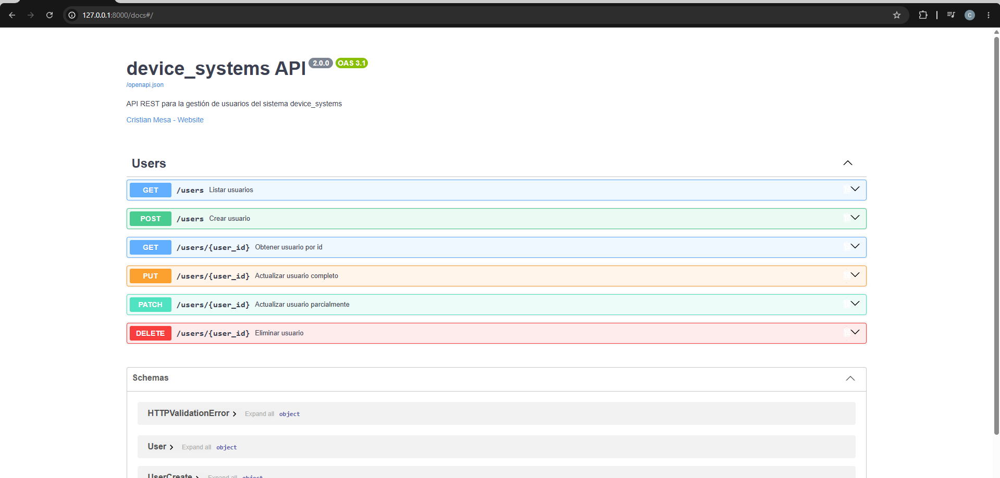

## Capturas de ReDoc

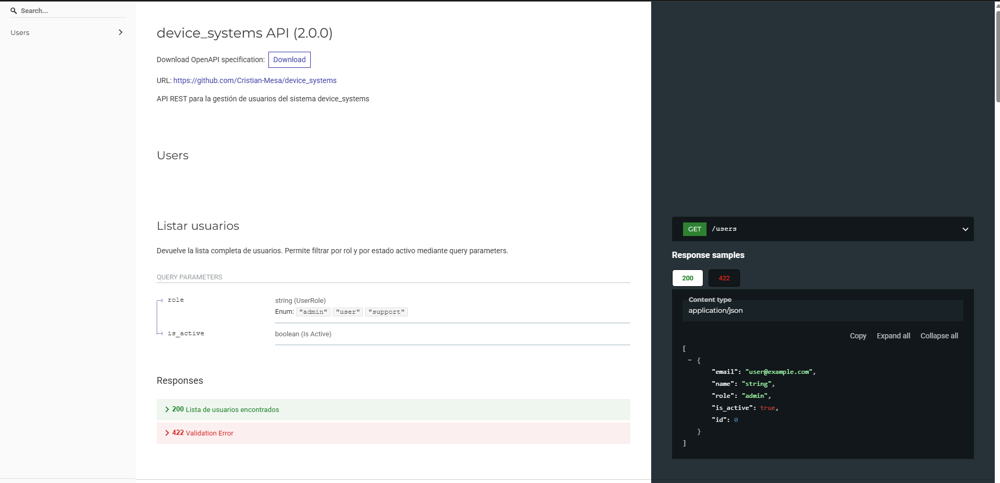

## Evidencias de pruebas

### GET /users

Listado completo, sin filtros.

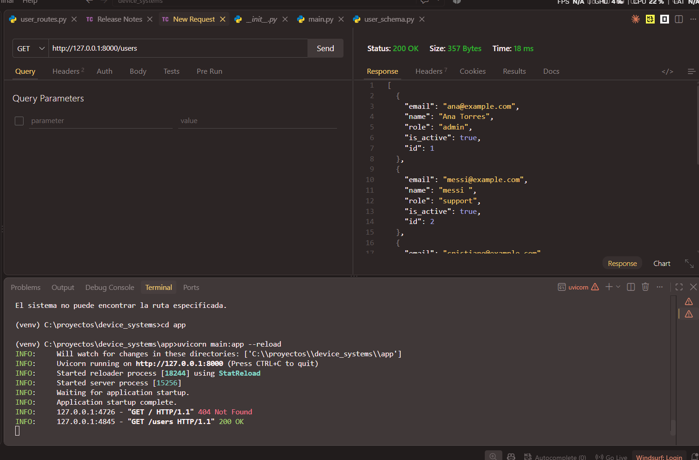

Consulta por id, con un id existente.

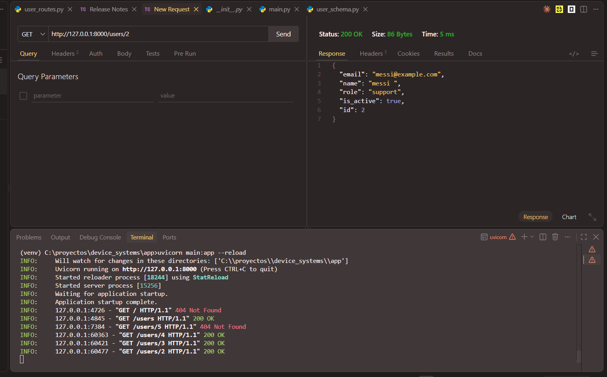

Filtro por rol usando query parameter.

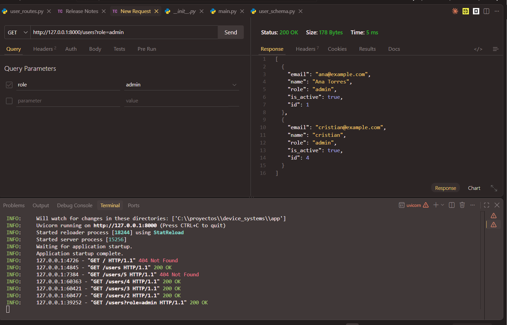

### GET /users/{user_id}

Consulta con un id que no existe, respondiendo 404.

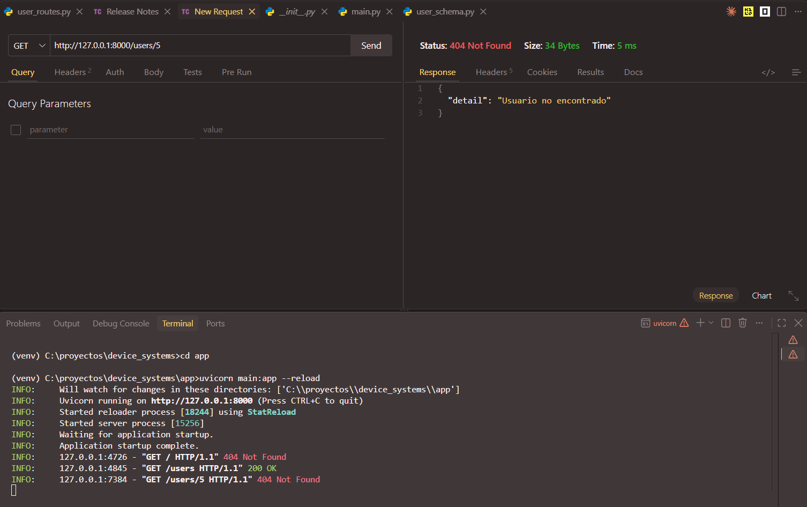

### POST /users

Creación de un usuario válido, respondiendo con el id generado.

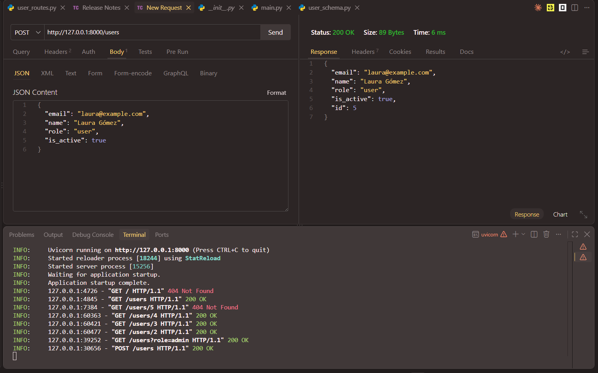

### PUT /users/{user_id}

Intento con campos faltantes, respondiendo 422.

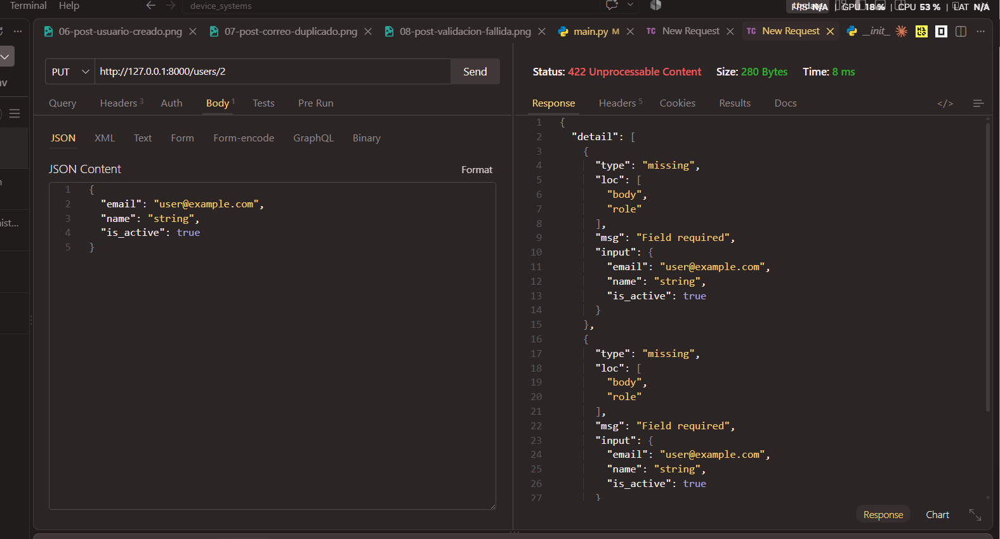

Actualización completa exitosa.

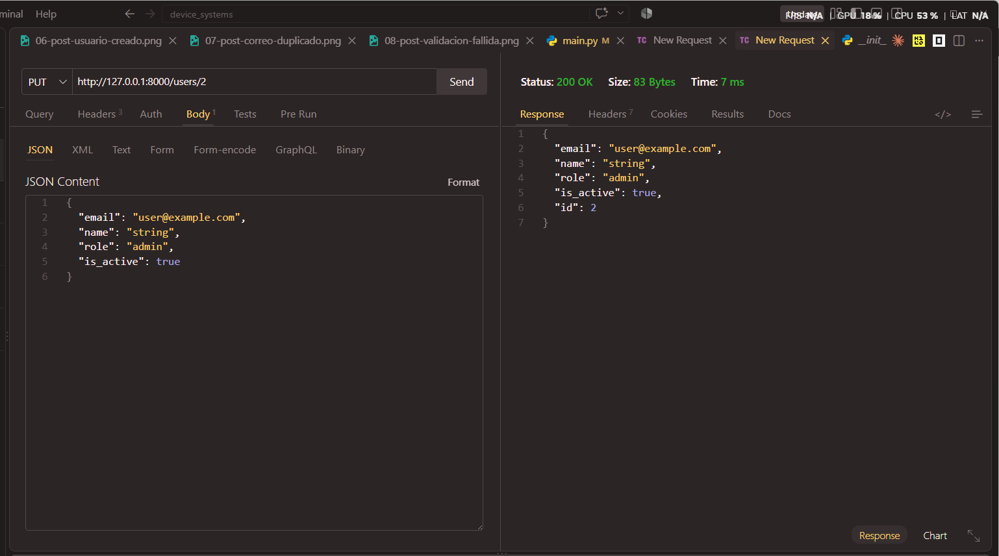

### PATCH /users/{user_id}

Actualización parcial exitosa, cambiando solo un campo.

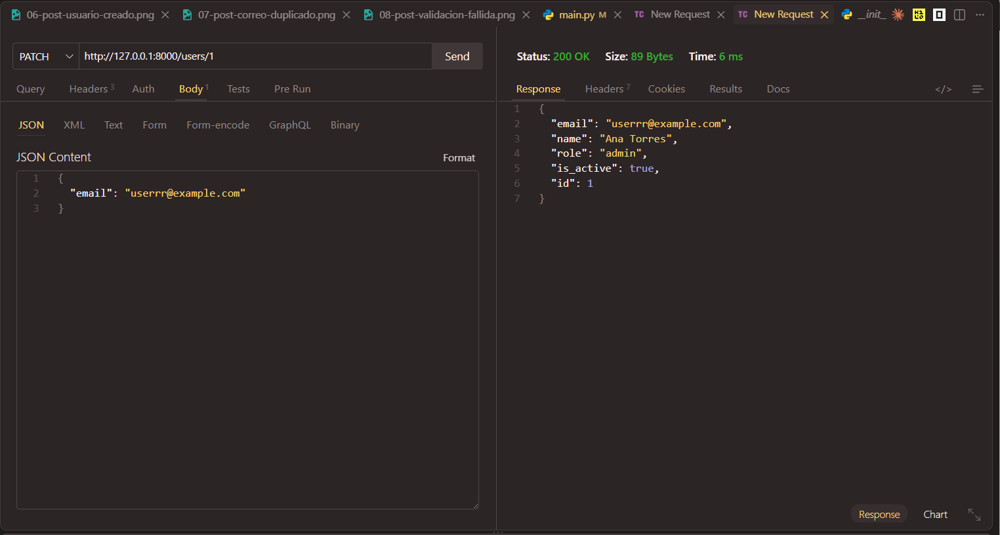

### DELETE /users/{user_id}

Eliminación exitosa, enviando la cabecera X-API-Key.

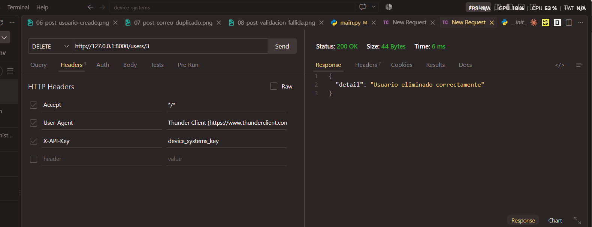

### Evidencia de validaciones y errores

Correo ya existente al crear, respondiendo 400.

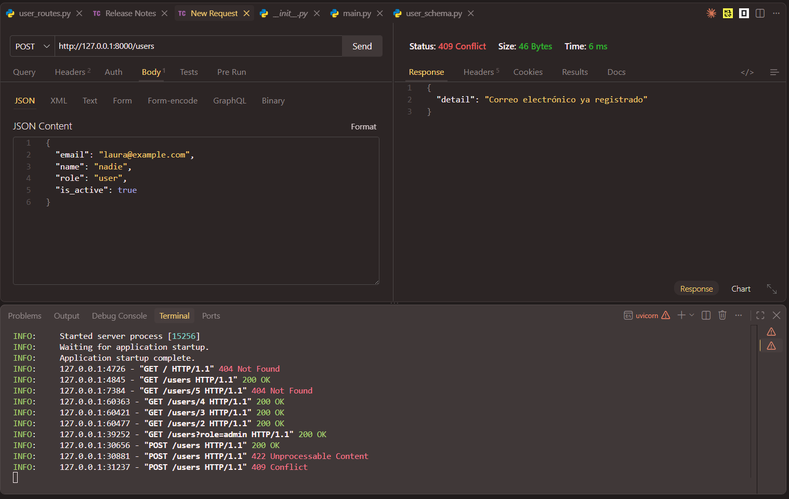

Datos que no cumplen las validaciones de Pydantic al crear, respondiendo 422.

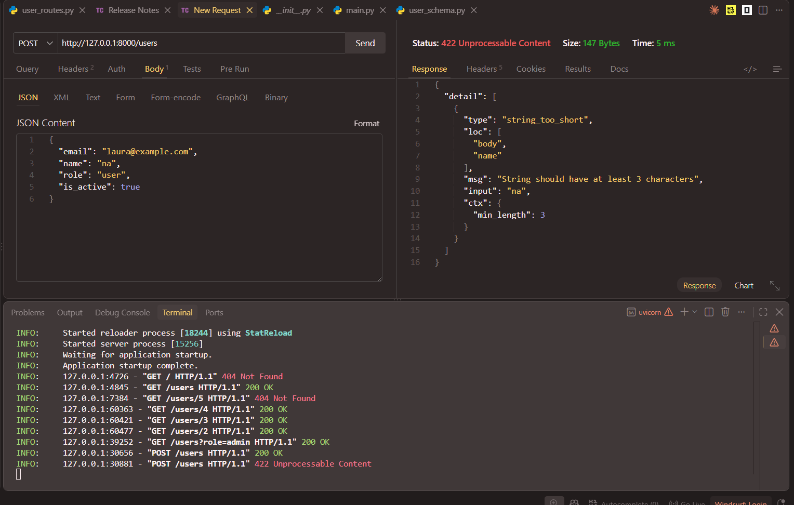

Correo ya existente al actualizar parcialmente, respondiendo 400.

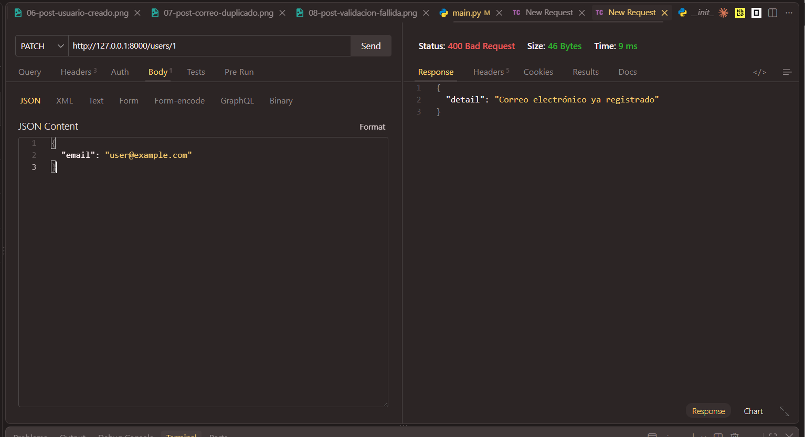

Cabeceras personalizadas X-App-Name y X-API-Version presentes en la respuesta.

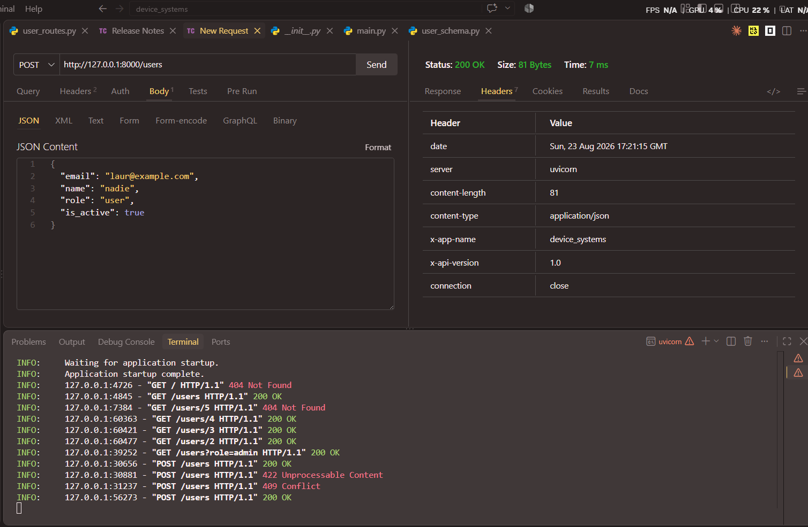

## Reflexión final

Evolucionar device_systems de un CRUD básico a una API más completa permitió entender por qué los proyectos reales se organizan en capas separadas: cuando la lógica de negocio vive en services y no mezclada con las rutas, agregar PUT, PATCH y DELETE fue mucho más ordenado que si todo hubiera seguido junto en un solo archivo. Trabajar con PATCH exigió pensar con cuidado la diferencia entre un campo que no se envía y uno que se envía vacío, algo que exclude_unset resuelve de forma elegante. Dependency Injection cambió la forma de ver las rutas: en vez de repetir validaciones y búsquedas en cada endpoint, esas responsabilidades se trasladan a funciones que FastAPI ejecuta automáticamente antes de la ruta, incluso permitiendo que una dependencia dependa de otra, como ocurre entre la configuración de la API y las cabeceras, o entre la búsqueda del usuario y la validación del correo al actualizar. Ajustar los códigos de estado según el estándar HTTP, distinguiendo 200 de 201, o revisando en qué casos corresponde 400 en vez de 409, dejó más claro que cada código comunica algo específico sobre lo que pasó con la petición, y que documentarlo bien en Swagger y ReDoc hace que la API sea entendible para cualquiera que la consuma sin tener que leer el código fuente.
