# device_systems

API REST hecha con FastAPI para administrar usuarios, dispositivos y prestamos.

En esta version el proyecto usa SQLAlchemy, SQLite y Alembic. Un usuario puede
recibir dispositivos por medio de prestamos, y cada prestamo queda guardado en
el historial.

## Tecnologias

- Python
- FastAPI
- SQLAlchemy
- SQLite
- Alembic
- Pydantic v2
- Uvicorn
- Git y GitHub

## Estructura

```text
device_systems/
|-- app/
|   |-- database/
|   |-- models/
|   |-- schemas/
|   |-- routes/
|   `-- services/
|-- alembic/
|   `-- versions/
|-- evidencias/
|-- alembic.ini
|-- requirements.txt
`-- README.md
```

## Instalacion

```powershell
git clone https://github.com/Cristian-Mesa/device_systems.git
cd device_systems
python -m venv venv
venv\Scripts\activate
pip install -r requirements.txt
```

## Ejecutar el proyecto

Primero se crean o actualizan las tablas con Alembic:

```powershell
alembic upgrade head
```

Luego se inicia la API desde la raiz del proyecto:

```powershell
uvicorn app.main:app --reload
```

La documentacion se puede abrir en:

- `http://127.0.0.1:8000/docs`
- `http://127.0.0.1:8000/redoc`

## Migraciones con Alembic

Alembic guarda los cambios de la base de datos en archivos de migracion. La
migracion inicial crea estas tablas:

- `users`
- `devices`
- `loans`

Comandos usados:

```powershell
alembic current
alembic history
alembic upgrade head
```

Para un cambio futuro en los modelos se puede crear otra migracion con:

```powershell
alembic revision --autogenerate -m "descripcion del cambio"
alembic upgrade head
```

## Modelos y relaciones

- Un `User` puede tener varios prestamos.
- Un `Device` puede aparecer en varios prestamos del historial.
- Un `Loan` une un usuario con un dispositivo.
- Cuando se presta un dispositivo, queda como no disponible.
- Cuando se devuelve, vuelve a estar disponible.

## Endpoints principales

### Usuarios

- `GET /users`
- `GET /users/{usuario_id}`
- `POST /users`
- `PUT /users/{usuario_id}`
- `PATCH /users/{usuario_id}`
- `DELETE /users/{usuario_id}`
- `GET /users/{usuario_id}/loans`

### Dispositivos

- `GET /devices`
- `GET /devices/{device_id}`
- `POST /devices`
- `PUT /devices/{device_id}`
- `PATCH /devices/{device_id}`
- `DELETE /devices/{device_id}`
- `GET /devices/{device_id}/loans`

Filtros disponibles: `device_type`, `is_available`, `brand` y `search`.

### Prestamos

- `GET /loans`
- `GET /loans/details`
- `GET /loans/{loan_id}`
- `POST /loans`
- `PATCH /loans/{loan_id}/return`

Filtros disponibles: `status`, `user_email` y `device_type`.

## Reglas importantes

- No se puede prestar un dispositivo que ya esta ocupado.
- Un prestamo debe tener un usuario y un dispositivo existentes.
- Un numero de serie no se puede repetir.
- Al devolver un dispositivo, el prestamo pasa a `returned`.
- No se puede borrar un usuario o dispositivo que tenga prestamos registrados.

## Evidencias

### Alembic y Swagger

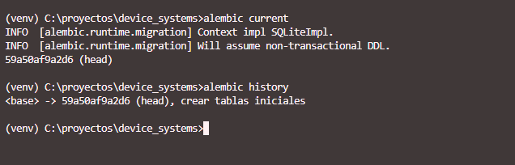

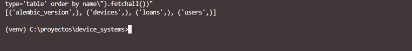

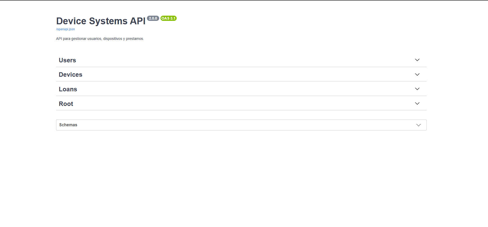

### Usuarios, dispositivos y prestamos

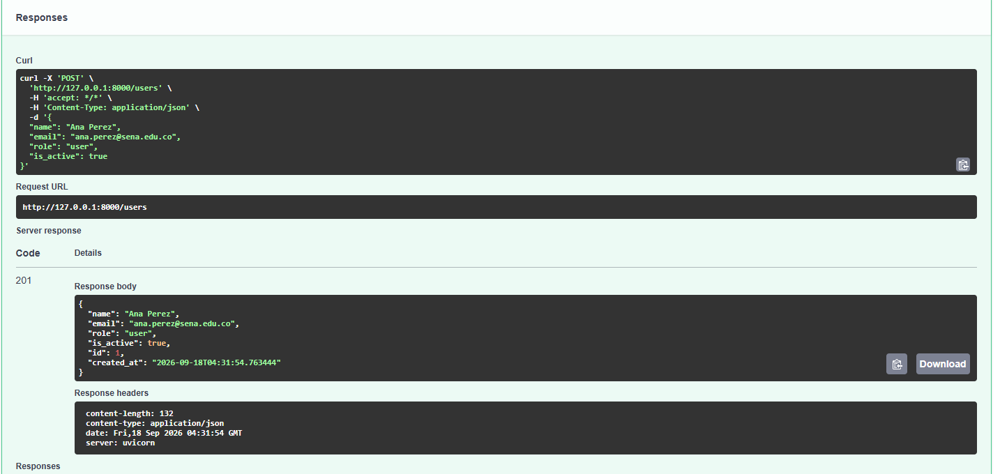

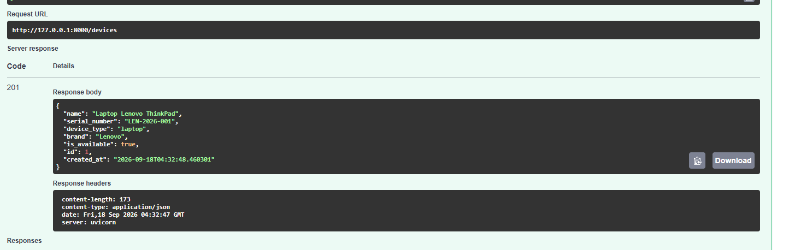

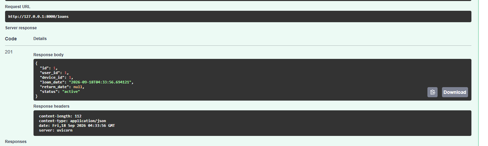

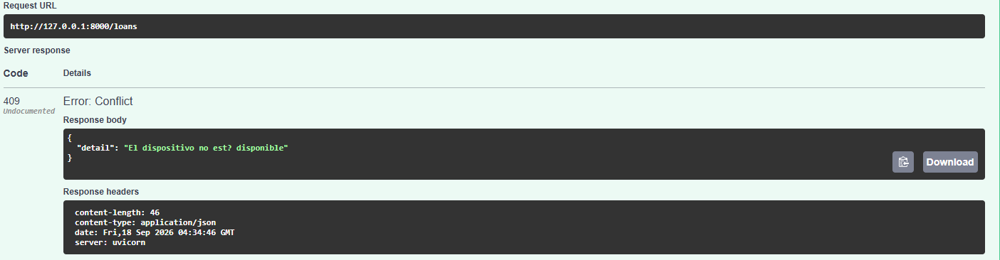

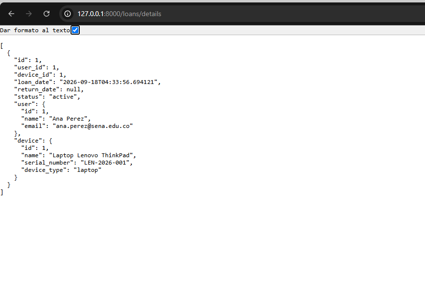

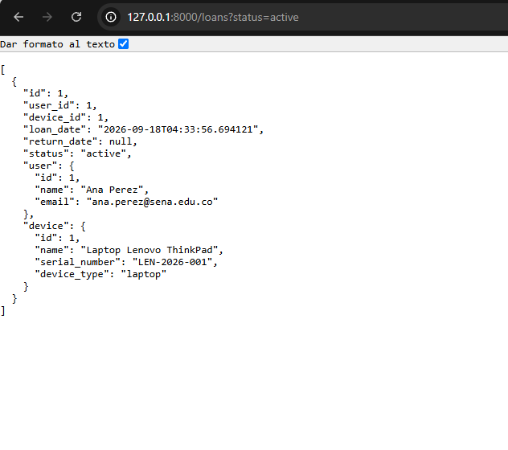

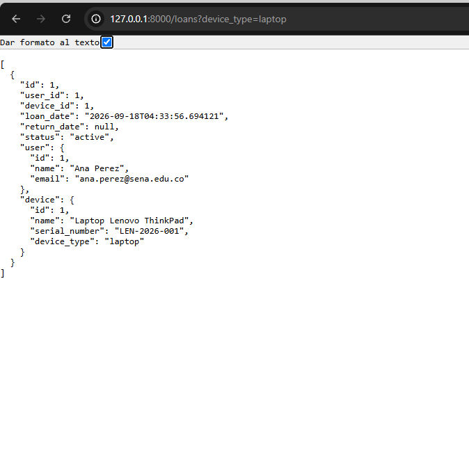

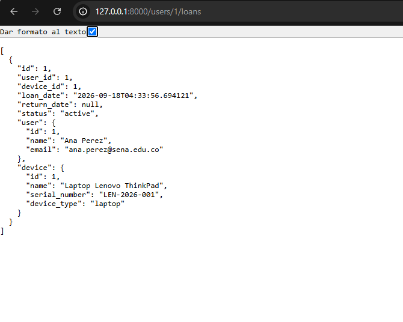

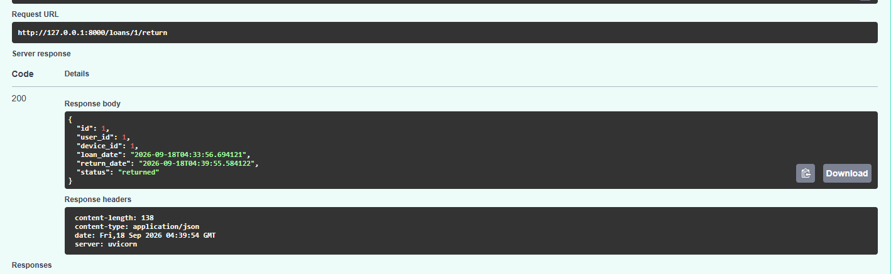

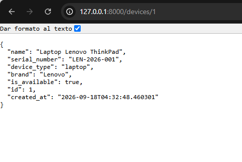

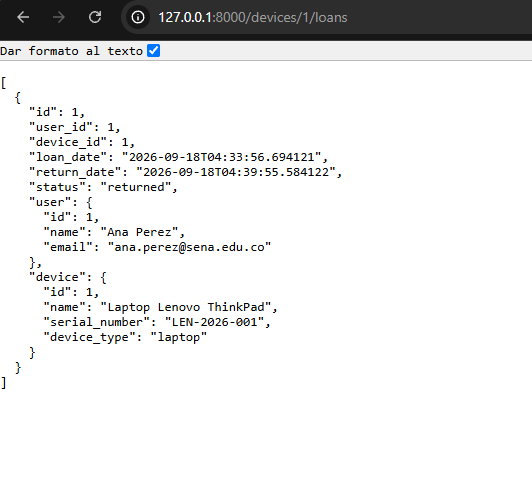

## Reflexion

Con esta actividad aprendi que Alembic ayuda a mantener organizada la base de
datos cuando el proyecto va creciendo. Tambien entendi como relacionar tablas
con claves foraneas y como consultar informacion de usuarios, dispositivos y
prestamos en una sola respuesta.
