# device_systems

API REST hecha con FastAPI para administrar usuarios, dispositivos y prestamos.

En esta version se agrego seguridad: registro, inicio de sesion, token JWT,
roles, CORS, middleware y limite de peticiones.

## Que puede hacer la API

- Crear y consultar usuarios.
- Crear, actualizar y consultar dispositivos.
- Registrar prestamos y devoluciones.
- Registrar usuarios con una contrasena segura.
- Iniciar sesion y usar un token para las rutas privadas.

## Instalacion

```powershell
git clone https://github.com/Cristian-Mesa/device_systems.git
cd device_systems
python -m venv venv
venv\Scripts\activate
pip install -r requirements.txt
Copy-Item .env.example .env
```

En el archivo `.env` se debe colocar una clave secreta propia en `SECRET_KEY`.

## Ejecutar el proyecto

Primero se actualiza la base de datos:

```powershell
alembic upgrade head
```

Luego se inicia la API:

```powershell
uvicorn app.main:app --reload
```

La documentacion se abre en:

- `http://127.0.0.1:8000/docs`
- `http://127.0.0.1:8000/redoc`

## Seguridad

### Registro e inicio de sesion

- `POST /auth/register` crea una cuenta. La contrasena debe tener minimo 8 caracteres, una mayuscula, una minuscula y un numero. No puede tener espacios.
- `POST /auth/login` recibe el correo en el campo `username` y la contrasena en `password`.
- `GET /auth/me` muestra los datos del usuario que envio un token valido.

La contrasena no se guarda como texto normal. Se guarda un hash, que es una version protegida de la contrasena.

El token dura 30 minutos. Cuando vence, se debe iniciar sesion otra vez para recibir uno nuevo.

En Swagger se puede usar el boton **Authorize**: se escribe el correo en `username`, la contrasena y Swagger envia el token en las rutas protegidas.

### Roles

- Un usuario autenticado puede consultar usuarios y registrar prestamos.
- `admin` y `support` pueden crear o editar dispositivos, devolver prestamos y consultar detalles de prestamos.
- Solo `admin` puede eliminar dispositivos.

Sin token, o con un token invalido, la API responde `401`. Si el token es valido pero el rol no tiene permiso, responde `403`.

## CORS, middleware y limites

CORS permite que los frontends locales `http://localhost:5173` y `http://localhost:3000` usen la API. No se usa `*` como origen porque con credenciales seria menos seguro permitir cualquier pagina.

Cada respuesta incluye estas cabeceras:

- `X-App-Name`: identifica la aplicacion.
- `X-Process-Time`: muestra cuanto tardo la peticion.
- `X-Request-ID`: identifica la peticion para encontrarla en los registros.

Tambien hay limites para evitar muchos intentos seguidos desde la misma direccion:

- Registro: 3 por minuto.
- Login: 5 por minuto.
- Listado de usuarios: 30 por minuto.
- Creacion de prestamos: 10 por minuto.

Cuando se supera un limite, la respuesta es `429 Too Many Requests`.

## Alembic

Alembic guarda los cambios de la base de datos. Las tablas principales son:

- `users`
- `devices`
- `loans`

Tambien agrega el campo `hashed_password` para los usuarios nuevos.

Comandos utiles:

```powershell
alembic current
alembic history
alembic upgrade head
```

## Endpoints principales

### Auth

- `POST /auth/register`
- `POST /auth/login`
- `GET /auth/me`

### Usuarios

- `GET /users`
- `GET /users/{usuario_id}`
- `POST /users`
- `PUT /users/{usuario_id}`
- `PATCH /users/{usuario_id}`
- `DELETE /users/{usuario_id}`
- `GET /users/{usuario_id}/loans`

### Dispositivos

- `GET /devices`
- `GET /devices/{device_id}`
- `POST /devices`
- `PUT /devices/{device_id}`
- `PATCH /devices/{device_id}`
- `DELETE /devices/{device_id}`
- `GET /devices/{device_id}/loans`

### Prestamos

- `GET /loans`
- `GET /loans/details`
- `GET /loans/{loan_id}`
- `POST /loans`
- `PATCH /loans/{loan_id}/return`

## Reglas importantes

- Un numero de serie no se puede repetir.
- No se puede prestar un dispositivo que no este disponible.
- Al devolverlo, el dispositivo vuelve a estar disponible.
- No se puede borrar un usuario o dispositivo que tenga prestamos registrados.

## Evidencias

### Estructura y migracion

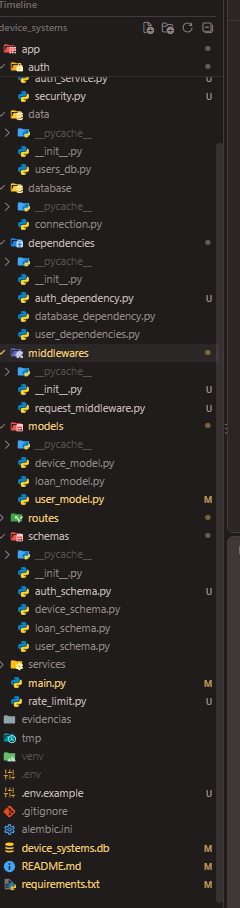

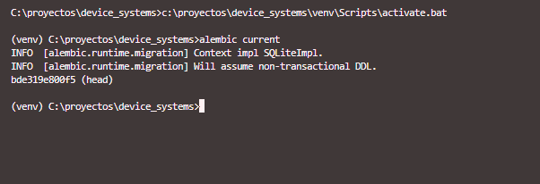

### Seguridad y autenticacion

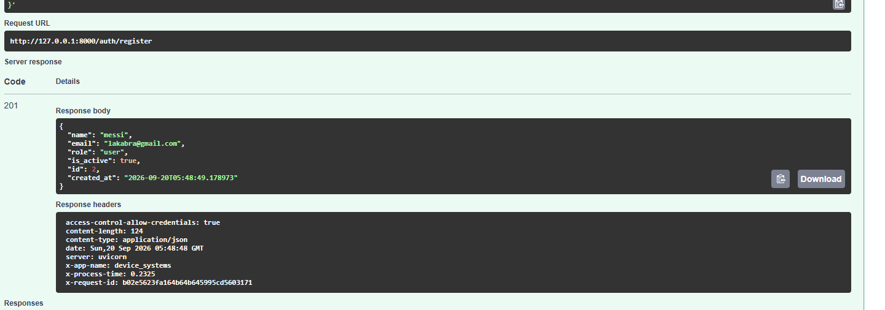

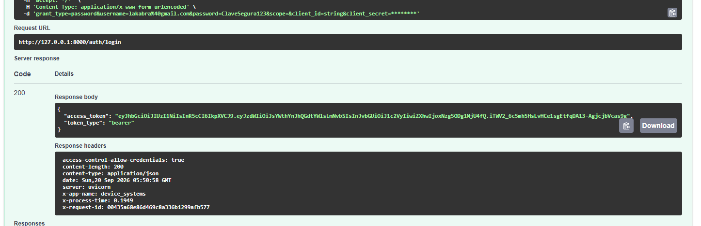

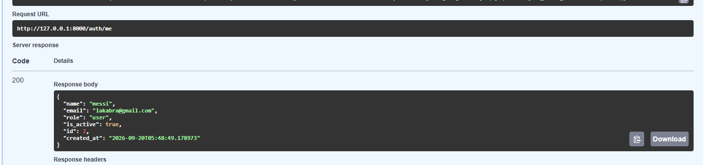

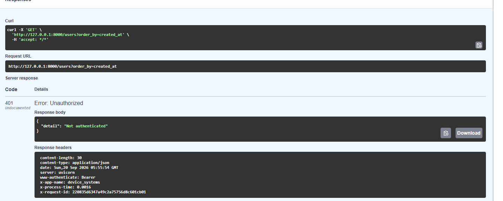

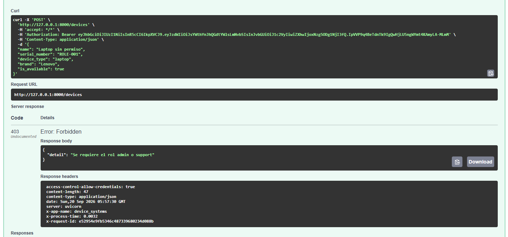

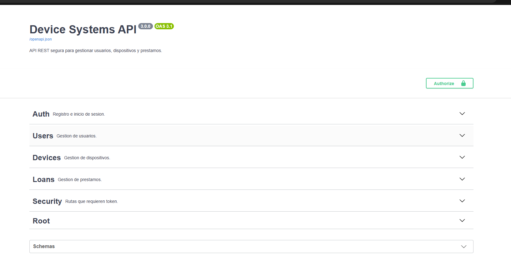

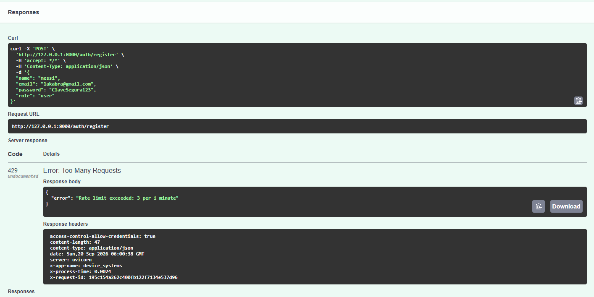

### Actividad anterior


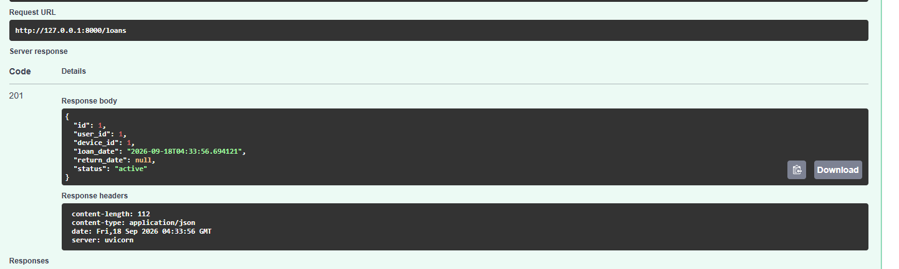

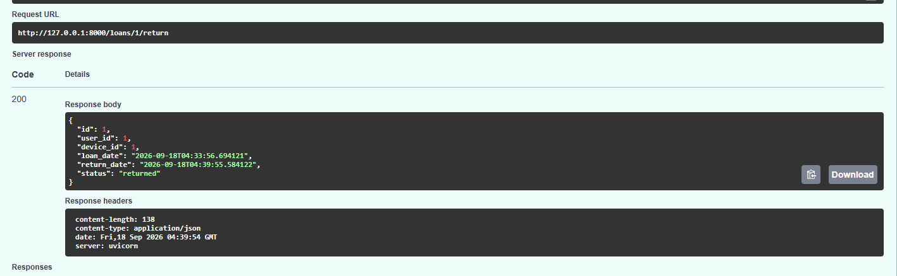

## Reflexion

Aprendi que una API no solo debe funcionar: tambien debe cuidar las contrasenas,
controlar quien puede hacer cada accion y evitar peticiones repetidas. Con estas
medidas, el proyecto queda mas organizado y mas seguro para usar desde un frontend.